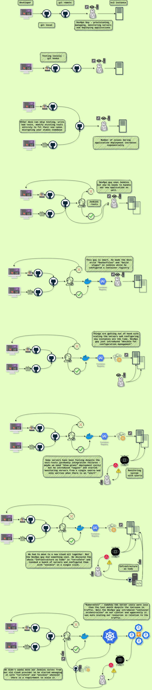

# How do you become a Devops engineer in a month ?

Bear with for a minute, I might have something valuable here.

Three words: ***Simulate Development Team***. We'll get to that in a moment.

## What is Devops ?

[AWS](https://aws.amazon.com/devops/what-is-devops/):
  DevOps is the combination of cultural philosophies, practices, and tools that increases an organization’s ability to deliver applications and services at high velocity

[WIKI](https://en.wikipedia.org/wiki/DevOps):
  DevOps is a set of practices that combines software development (Dev) and IT operations (Ops). It aims to shorten the systems development life cycle and provide continuous delivery with high software quality.

[MICROSOFT](https://azure.microsoft.com/en-us/overview/what-is-devops/):
  A compound of development (Dev) and operations (Ops), DevOps is the union of people, process, and technology to continually provide value to customers.

### Okay! What are we dealing with here ?

All the jargon above sounds to me like it's more of a culture (a pattern of behaviour) that a team of people practice to achieve optimal development lifecycle in the Tech industry.

Sounds familiar? hint: *AGILE*

### Then what/who is a DevOps engineer here ?

This is probably the coolest part for me. A DevOps engineer is someone who ensures and manages this culture with every resource out there.

Sounds like a lot of responsibility. That is why we have an **engineer** for that role. Some one who can understand, utilize and innovate with **technology** to make this happen.

### The learning strategy

There are two short scenarios I want to present to you so that one can understand the significance of the strategy.

*Only utilize this stategy if you absolutely believe that you are at a similar junction of your learning map*

#### Scenario 1:

My first job ever was machine learning engineer at a startup (I was not even a computer science major).

Transformation of our roles in 2 year span:

- Scenario:
  - We built AI models which would automate some manual processes of e-commerce industry.
- Problem:
  - We manually ran the models on the data every time we recieved a new set of data.

- Scenario:
  - We were using the data to train new models and improve our old models as well
- Problem:
  - We moved/downloaded data manually to GPU instances to perform data and model operations
- Solution:
  - We automated these data operations by building **ETL pipelines from scratch** essentially in python (backend in a microservice architecture)

- Scenario:
  - We built automate pipelines (python programs and microservices)

### What do you have to know to be one ?

I'm not going to go into the details of what DevOps is because there are 1000s of articles and tutorials out there for us to make the most out of.

We are here to explore the **learning strategy** to acquire the skills of a devops engineer in a more abstract format.

Let's speculate through a ficticious narrative of the evolution of devops in a company.

We tried to demonstrate the tech architecture of a company and how it evolves in the illustration above.
  Note: there are quite a few things missing in the above illustration. I'll have to spend way too much time if I try to generate these illustrations for every possible scenario. For example I skipped the GIT BRANCHING STRATEGY, DEPLOYMENT / ROLE OUT METHODS, DIFFERENT TYPES OF TESTING - UAT, SMOKE, INTEGRATION, etc.

It is clear that a company would go through such a transformation everytime a new problem manifests itself in the **Software Development Life Cycle** relm. All we need to do is simulate the same environment and actually implement the architecture required to solve the problem.

Looking at the illustration, we can clearly see how all the buzzwords, the list of technologies you are on the cusp of learning actually come together. 